# 🛡️ SOC Automation Lab

<div align="center">

### Stack Principale

<p>
  
  &nbsp;&nbsp;&nbsp;
  
  &nbsp;&nbsp;&nbsp;
  
  &nbsp;&nbsp;&nbsp;
  
  &nbsp;&nbsp;&nbsp;
  
  &nbsp;&nbsp;&nbsp;
  
</p>

---


**Lab SOC Blue Team complet — Détection automatisée d'attaques MITRE ATT&CK avec enrichissement Threat Intelligence, gestion d'incidents et alertes en temps réel.**

[📋 Architecture](#-architecture) • [🚀 Déploiement](#-déploiement) • [🎯 Règles MITRE](#-règles-mitre-attck) • [🤖 Workflows SOAR](#-workflows-soar) • [🐝 TheHive](#-thehive--gestion-dincidents) • [🐛 Troubleshooting](#-problèmes-rencontrés-et-solutions) • [📊 Résultats](#-résultats)

</div>

---

## 🏆 Résultat Final

> **Pipeline complet opérationnel** : Wazuh détecte une menace → Sysmon extrait le hash SHA256 → Shuffle automatise l'analyse → VirusTotal confirme la malveillance → TheHive crée un ticket → Email enrichi envoyé en temps réel.

### Exemple — Détection WannaCry (70/76 antivirus)

```
🚨 RAPPORT ANALYSE MALWARE — SOC ALERT

Agent          : windows-host
IP Agent       : 172.28.80.1
Processus      : C:\Windows\Temp\wannacry.exe
Hash SHA256    : 24d004a104d4d54034dbcffc2a4b19a11f39008a575aa614ea04703480b1022c
Timestamp      : 2026-03-16T22:10:00.000+0000
Règle          : Credential dumping tool detected — Level 15

🔬 Résultat VirusTotal
Label          : trojan.wannacry/wanna
Détections     : 70 / 76 antivirus
CVE            : CVE-2017-0144 (EternalBlue) · CVE-2017-0147 (EternalRomance)
Sandbox        : MALICIOUS (Zenbox, C2AE, Lastline, Tencent HABO)
Réputation     : -1790
```

<!-- SCREENSHOT : Email WannaCry reçu -->
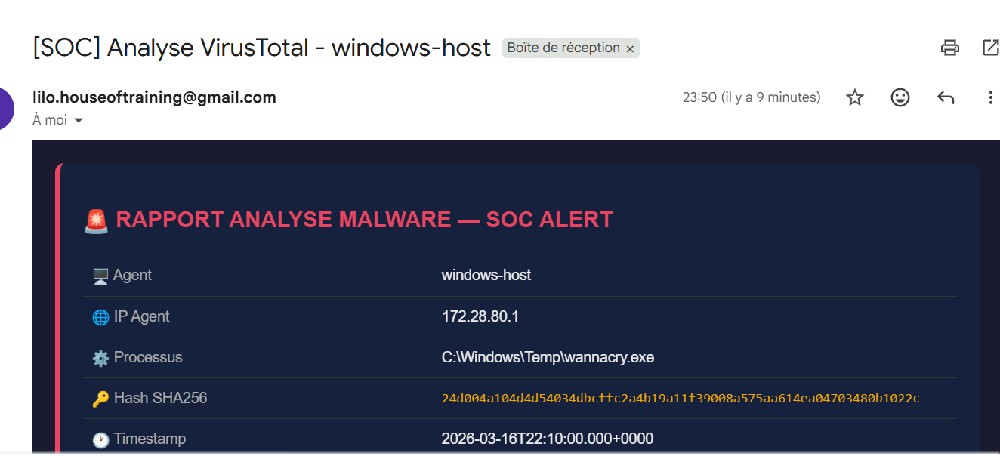

---

## 📐 Architecture

```
┌─────────────────────────────────────────────────────────────────┐
│                        WINDOWS 11 HOST                          │
│                                                                 │
│  ┌─────────────┐    ┌──────────────┐    ┌──────────────────┐   │
│  │   Sysmon    │───▶│ Wazuh Agent  │───▶│   Event Logs     │   │
│  │ (SwiftOnSec)│    │   (MSI)      │    │ Security/Sysmon  │   │
│  └─────────────┘    └──────────────┘    └──────────────────┘   │
└────────────────────────────┬────────────────────────────────────┘
                             │ TCP 1514
                             ▼
┌─────────────────────────────────────────────────────────────────┐
│                    WSL2 / DOCKER                                 │
│                                                                 │
│  ┌──────────────────────────────────────────────────────────┐   │
│  │                    WAZUH SIEM                            │   │
│  │  ┌─────────────┐  ┌─────────────┐  ┌─────────────────┐  │   │
│  │  │   Manager   │  │   Indexer   │  │    Dashboard    │  │   │
│  │  │  (Analyse)  │  │(OpenSearch) │  │  (Kibana-like)  │  │   │
│  │  └──────┬──────┘  └─────────────┘  └─────────────────┘  │   │
│  │         │ 11 Règles MITRE ATT&CK — Level ≥ 7             │   │
│  └─────────┼────────────────────────────────────────────────┘   │
│            │ Webhook (JSON)                                      │
│            ▼                                                     │
│  ┌──────────────────────────────────────────────────────────┐   │
│  │                   SHUFFLE SOAR                           │   │
│  │                                                          │   │
│  │  Workflow 1: Webhook ──▶ TheHive (ticket) ──▶ Email      │   │
│  │                                                          │   │
│  │  Workflow 2: Webhook ──▶ Regex SHA256 ──▶ VirusTotal     │   │
│  │                                       ──▶ Email enrichi  │   │
│  └──────────┬────────────────────────────┬──────────────────┘   │
│             │                            │ HTTPS API             │
│             ▼                            ▼                       │
│  ┌──────────────────┐        ┌──────────────────┐               │
│  │    THEHIVE 5.2   │        │   VIRUSTOTAL     │               │
│  │  Gestion tickets │        │  Threat Intel    │               │
│  │  Cassandra + ES  │        │  /api/v3/files   │               │
│  │  :9000           │        │                  │               │
│  └──────────────────┘        └──────────────────┘               │
└─────────────────────────────────────────────────────────────────┘
```

<!-- SCREENSHOT : Dashboard Wazuh -->
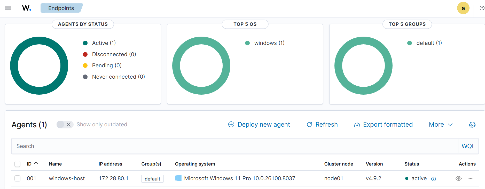

---

## 🎯 Objectifs du Projet

Ce lab simule l'environnement d'un **SOC (Security Operations Center)** réel avec :

- **Détection** des menaces en temps réel via SIEM
- **Corrélation** d'événements Windows/Sysmon avec règles MITRE ATT&CK
- **Automatisation** de la réponse via SOAR
- **Enrichissement** Threat Intelligence via VirusTotal
- **Gestion d'incidents** via TheHive
- **Notification** email enrichie pour l'analyste SOC

---

## 🧠 C'est Quoi un SIEM, SOAR et IRP ?

### 🔍 SIEM — Security Information and Event Management

Un SIEM est le **système nerveux central d'un SOC**. Il collecte, centralise et corrèle les logs de toutes les sources de l'infrastructure pour détecter les comportements suspects.

**Sans SIEM :**
```
Windows logs → perdus dans l'Event Viewer local
Linux logs   → éparpillés sur chaque serveur
Réseau logs  → inaccessibles sans accès physique
```

**Avec SIEM (Wazuh) :**
```
Windows logs ──┐
Linux logs   ──┼──▶ Wazuh Manager ──▶ Corrélation ──▶ Alerte
Réseau logs  ──┘         │
                    11 règles MITRE ATT&CK
```

### ⚡ SOAR — Security Orchestration, Automation and Response

Le SOAR (Shuffle) automatise les tâches répétitives de l'analyste SOC :

| Sans SOAR | Avec SOAR (Shuffle) |
|-----------|---------------------|
| Analyste reçoit une alerte | Alerte automatiquement enrichie |
| Copie le hash manuellement | Hash extrait automatiquement par regex |
| Va sur VirusTotal | VirusTotal interrogé automatiquement |
| Crée un ticket manuellement | Ticket TheHive créé automatiquement |
| Écrit un rapport | Email enrichi envoyé en 30 secondes |
| **15-20 minutes** | **< 30 secondes** |

### 🐝 IRP — Incident Response Platform (TheHive)

TheHive centralise la gestion des incidents SOC :

- **Tickets automatiques** depuis les alertes Wazuh
- **Traçabilité** de chaque incident
- **Collaboration** entre analystes
- **Workflow** de réponse structuré

### Pourquoi ces outils open source ?

| Lab | Équivalent Entreprise |
|-----|----------------------|
| Wazuh | Splunk, QRadar, Microsoft Sentinel |
| Shuffle | Palo Alto XSOAR, Splunk SOAR |
| TheHive | ServiceNow, IBM Resilient |
| VirusTotal API | ThreatConnect, MISP |
| Sysmon | EDR (CrowdStrike, SentinelOne) |

---

## 🛠️ Stack Technique

| Composant | Version | Rôle |
|-----------|---------|------|
| **Wazuh Manager** | 4.9.2 | SIEM — Collecte et analyse des logs |
| **Wazuh Indexer** | 4.9.2 | Base de données OpenSearch |
| **Wazuh Dashboard** | 4.9.2 | Interface de visualisation |
| **Shuffle** | Latest | SOAR — Automatisation des réponses |
| **TheHive** | 5.2 | IRP — Gestion des incidents |
| **Cassandra** | 4 | Base de données TheHive |
| **Elasticsearch** | 7.17.12 | Indexation TheHive |
| **Sysmon** | v15.15 | Télémétrie avancée Windows |
| **VirusTotal API** | v3 | Threat Intelligence |
| **Docker** | 28.1.1 | Conteneurisation |
| **WSL2** | Ubuntu 24 | Environnement Linux sur Windows |
| **Windows 11** | 23H2 | Machine victime / Agent |

---

## 🚀 Déploiement

### Prérequis

```bash
# Windows 11 avec WSL2
# Docker Desktop 28.x
# RAM : 12GB minimum (16GB recommandé)
# Disk : 30GB minimum

# Vérifier WSL2
wsl --version

# Vérifier Docker
docker --version
docker compose version
```

> ⚠️ **RAM WSL2** : Augmenter à 12GB dans `C:\Users\<user>\.wslconfig` :
> ```
> [wsl2]
> memory=12GB
> processors=4
> swap=4GB
> ```

### ⚙️ Configuration Avant Déploiement

> **IMPORTANT** — Avant tout `./deploy.sh`, configure tes credentials. Ne commite jamais le fichier `.env`.

#### Étape 1 — Créer le fichier `.env`

```bash
cp .env.example .env
```

#### Étape 2 — Éditer `.env` (fichier principal des secrets)

```bash
nano .env   # ou code .env
```

| Variable | Fichier impacté | Description | Exemple |
|---|---|---|---|
| `INDEXER_PASSWORD` | `docker/wazuh-docker-compose.yml` | Mot de passe admin Wazuh/OpenSearch | `MonMDP_Wazuh2026!` |
| `API_PASSWORD` | `docker/wazuh-docker-compose.yml` | Mot de passe API Wazuh (user `wazuh-wui`) | `MonMDP_API2026!` |
| `DASHBOARD_PASSWORD` | `docker/wazuh-docker-compose.yml` | Mot de passe service kibanaserver | `MonMDP_Dash2026!` |
| `THEHIVE_SECRET` | `docker/thehive-docker-compose.yml` | Clé secrète TheHive (32+ chars) | `uneCleSuperSecrete32chars!!` |
| `SHUFFLE_OPENSEARCH_PASSWORD` | `docker/shuffle-docker-compose.yml` | Mot de passe OpenSearch Shuffle | `MonMDP_Shuffle2026!` |
| `SHUFFLE_HOST_IP` | `config/ossec.conf` | IP WSL2 de ta machine (dynamique) | `172.28.93.74` |
| `SHUFFLE_WEBHOOK_GENERAL` | `config/ossec.conf` | ID du webhook Shuffle (général) | `webhook_xxxx-xxxx` |
| `SHUFFLE_WEBHOOK_VIRUSTOTAL` | `config/ossec.conf` | ID du webhook Shuffle (VirusTotal) | `webhook_xxxx-xxxx` |

#### Étape 3 — Récupérer ton IP WSL2 (pour `SHUFFLE_HOST_IP`)

```bash
# Dans WSL2 / terminal Linux :
ip addr show eth0 | grep 'inet ' | awk '{print $2}' | cut -d/ -f1
```

> L'IP WSL2 change à chaque redémarrage. `deploy.sh` la détecte automatiquement si tu laisses ce champ vide.

#### Étape 4 — Récupérer les IDs de webhooks Shuffle (pour `SHUFFLE_WEBHOOK_*`)

1. Ouvre Shuffle → `http://localhost:3001`
2. Va dans ton workflow → clique sur le trigger **Webhook**
3. Copie l'URL complète → l'ID est la partie `webhook_xxxxxxxx`

#### Récap des fichiers et ce qu'ils contiennent

| Fichier | Ce qu'il faut modifier | Sensible ? |
|---|---|---|
| `.env` | **Tous les mots de passe et secrets** | ✅ Ne pas commiter |
| `docker/wazuh-docker-compose.yml` | Rien — lit `.env` automatiquement | ⬜ |
| `docker/thehive-docker-compose.yml` | Rien — lit `.env` automatiquement | ⬜ |
| `docker/shuffle-docker-compose.yml` | Rien — lit `.env` automatiquement | ⬜ |
| `config/ossec.conf` | Rien — `deploy.sh` substitue l'IP au runtime | ⬜ |
| `config/wazuh_dashboard/wazuh.yml` | Rien — lit `API_USERNAME`/`API_PASSWORD` de l'env | ⬜ |

---

### 🚀 Déploiement Automatique (Recommandé)

```bash
git clone https://github.com/LiloBennardo/soc-automation-lab.git
cd soc-automation-lab
cp .env.example .env   # <-- édite .env avec tes valeurs
chmod +x deploy.sh
./deploy.sh
```

### Déploiement Manuel

#### 1. Cloner le repo

```bash
git clone https://github.com/LiloBennardo/soc-automation-lab.git
cd soc-automation-lab
```

#### 2. Déployer Wazuh

```bash
git clone https://github.com/wazuh/wazuh-docker.git
cd wazuh-docker/single-node

sudo sysctl -w vm.max_map_count=262144
echo "vm.max_map_count=262144" | sudo tee -a /etc/sysctl.conf

docker compose -f generate-indexer-certs.yml run --rm generator
docker compose up -d
```

**Dashboard :** `https://localhost` — `admin / <INDEXER_PASSWORD depuis .env>`

<!-- SCREENSHOT : Dashboard Wazuh -->


#### 3. Installer l'Agent Windows

```powershell
$WSL_IP = "172.28.93.74"  # Adapter à votre IP WSL2

Invoke-WebRequest -Uri "https://packages.wazuh.com/4.x/windows/wazuh-agent-4.9.2-1.msi" `
  -OutFile "$env:tmp\wazuh-agent.msi"

msiexec.exe /i "$env:tmp\wazuh-agent.msi" /q `
  WAZUH_MANAGER="$WSL_IP" `
  WAZUH_AGENT_NAME="windows-host"

NET START WazuhSvc
```

<!-- SCREENSHOT : Agent Windows connecté -->
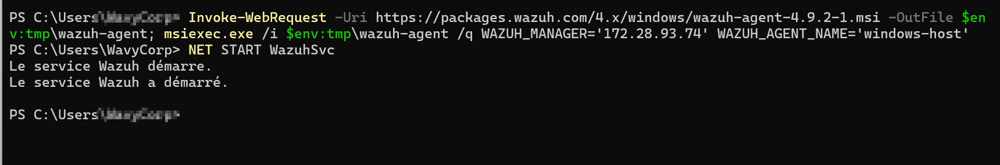

#### 4. Installer Sysmon

```powershell
New-Item -Path "C:\Tools\Sysmon" -ItemType Directory -Force
Set-Location "C:\Tools\Sysmon"

Invoke-WebRequest -Uri "https://download.sysinternals.com/files/Sysmon.zip" -OutFile "Sysmon.zip"
Expand-Archive -Path "Sysmon.zip" -DestinationPath "." -Force

Invoke-WebRequest -Uri "https://raw.githubusercontent.com/SwiftOnSecurity/sysmon-config/master/sysmonconfig-export.xml" `
  -OutFile "sysmonconfig.xml"

.\sysmon64.exe -i sysmonconfig.xml -accepteula
```

Ajouter dans `C:\Program Files (x86)\ossec-agent\ossec.conf` :
```xml
<localfile>
  <location>Microsoft-Windows-Sysmon/Operational</location>
  <log_format>eventchannel</log_format>
</localfile>
```

```powershell
Restart-Service WazuhSvc
```

<!-- SCREENSHOT : Logs Sysmon dans Wazuh -->
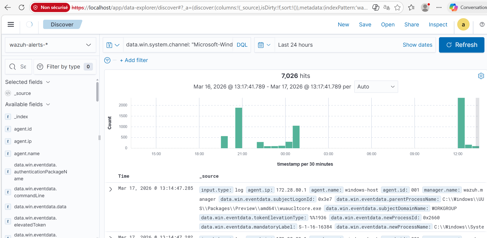

#### 5. Déployer Shuffle SOAR

```bash
git clone https://github.com/Shuffle/Shuffle.git
cd Shuffle

# Fixer conflit port 9200 avec Wazuh
sed -i 's/9200:9200/9201:9200/g' docker-compose.yml

# Initialiser Docker Swarm
docker swarm init --advertise-addr $(hostname -I | awk '{print $1}')

docker compose up -d
```

**Dashboard :** `http://localhost:3001`

#### 6. Déployer TheHive

```bash
mkdir ~/thehive && cd ~/thehive
cp ~/soc-automation-lab/docker/thehive-docker-compose.yml docker-compose.yml
docker compose up -d
```

**Dashboard :** `http://localhost:9000` — `admin@thehive.local / secret`

**Configuration TheHive :**
1. Créer organisation `SOC-Lab`
2. Créer utilisateur `soc@soc-lab.local` avec profil `analyst`
3. Générer une API key → noter pour l'intégration Shuffle

<!-- SCREENSHOT : TheHive Dashboard -->
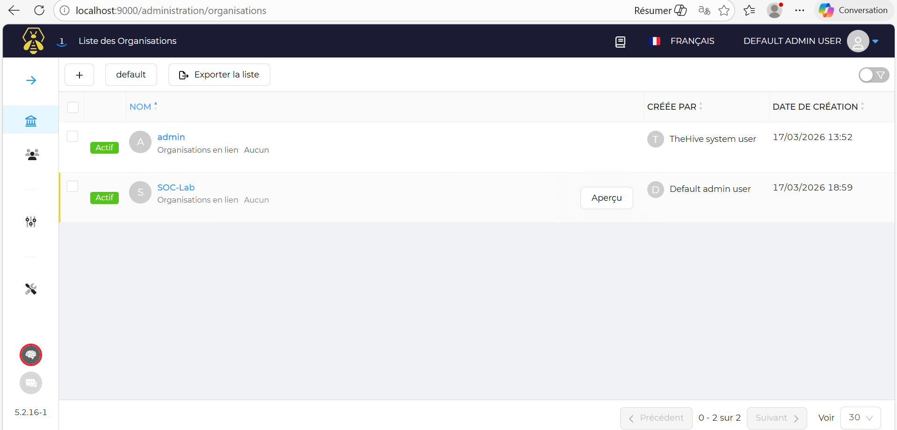

#### 7. Configurer l'Intégration Wazuh → Shuffle

```bash
docker cp ~/soc-automation-lab/config/ossec.conf single-node-wazuh.manager-1:/var/ossec/etc/ossec.conf
docker exec single-node-wazuh.manager-1 /var/ossec/bin/wazuh-control restart
```

Config intégrations dans `ossec.conf` :
```xml
<!-- Workflow 1 : Alertes Email + TheHive -->
<integration>
  <name>shuffle</name>
  <hook_url>http://WSL_IP:3001/api/v1/hooks/WEBHOOK_ID_1</hook_url>
  <level>7</level>
  <alert_format>json</alert_format>
</integration>

<!-- Workflow 2 : Analyse VirusTotal -->
<integration>
  <name>shuffle</name>
  <hook_url>http://WSL_IP:3001/api/v1/hooks/WEBHOOK_ID_2</hook_url>
  <group>sysmon_eid1_detections</group>
  <alert_format>json</alert_format>
</integration>
```

---

## 🎯 Règles MITRE ATT&CK

11 règles custom dans `rules/custom_local_rules.xml` :

| Rule ID | Description | MITRE | Level | Déclencheur |
|---------|-------------|-------|-------|-------------|
| 100001 | PowerShell obfusqué | T1059.001 | 12 | `-encodedcommand`, `-bypass`, `iex` |
| 100002 | Brute force SSH | T1110.001 | 10 | 5 échecs en 10 secondes |
| 100003 | Scan réseau | T1046 | 8 | `nmap`, `masscan`, `zmap` |
| 100004 | Création compte local | T1136.001 | 12 | Event ID 4720 |
| 100005 | Désactivation Defender | T1562.001 | 15 | `Set-MpPreference`, `DisableRealtimeMonitoring` |
| 100006 | Dump credentials | T1003.001 | 15 | `mimikatz`, `sekurlsa`, `procdump lsass` |
| 100007 | Exécution dossier suspect | T1036.005 | 10 | `\temp\`, `\appdata\`, `\downloads\` |
| 100008 | Persistance registre Run | T1547.001 | 10 | `CurrentVersion\Run` |
| 100009 | Sysmon — Création processus | T1059 | 12 | Sysmon Event ID 1 |
| 100010 | Sysmon — Connexion réseau | T1071 | 7 | Sysmon Event ID 3 |
| 100011 | Sysmon — Création fichier | T1105 | 5 | Sysmon Event ID 11 |

<!-- SCREENSHOT : Alertes Wazuh avec règles custom -->
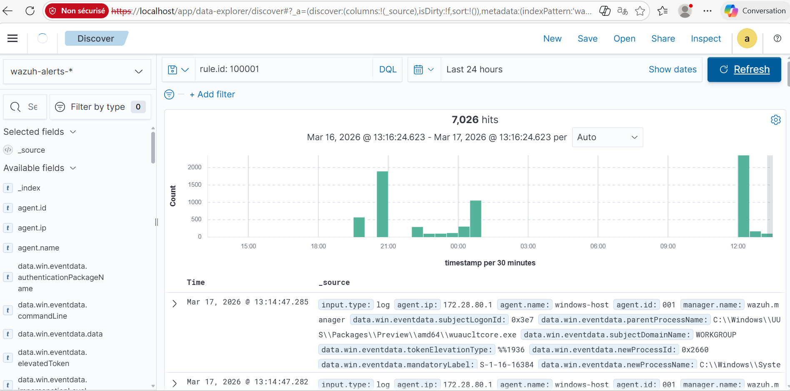

### Test des règles

```powershell
# Test T1059.001 — PowerShell obfusqué
powershell -noprofile -windowstyle hidden -command "Write-Host test"

# Test T1562.001 — Désactivation Defender (lab uniquement)
Set-MpPreference -DisableRealtimeMonitoring $true

# Test T1036.005 — Exécution depuis répertoire suspect
Copy-Item "C:\Windows\System32\cmd.exe" "$env:TEMP\cmd.exe"
Start-Process "$env:TEMP\cmd.exe"
```

---

## 🤖 Workflows SOAR

### Workflow 1 — Alertes Email + TheHive

**Pipeline :**
```
Wazuh (Level ≥ 7) → Webhook → TheHive (ticket) → Email enrichi
```

**Nœuds :**
| Nœud | Type | Action |
|------|------|--------|
| Webhook 1 | Trigger | Reçoit alertes Wazuh |
| HTTP | POST | Crée ticket TheHive |
| Email 1 | SMTP | Envoie alerte par email |

<!-- SCREENSHOT : Workflow 1 Shuffle -->
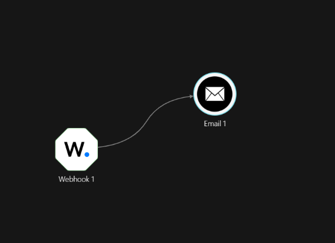

<!-- SCREENSHOT : Email alerte reçu -->
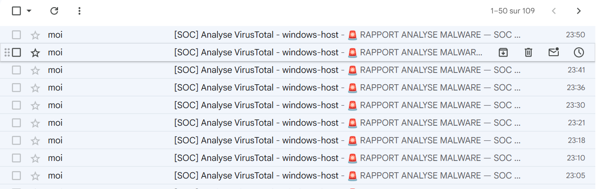

---

### Workflow 2 — Analyse VirusTotal Automatique

**Pipeline :**
```
Wazuh (Sysmon) → Webhook → Regex SHA256 → Regex Clean → HTTP VirusTotal → Email enrichi
```

**Nœuds :**
| Nœud | Type | Configuration |
|------|------|---------------|
| Webhook 2 | Trigger | Reçoit JSON Wazuh |
| Shuffle Tools 1 | Regex | Extrait SHA256 — `SHA256=([A-Fa-f0-9]{64})` |
| Shuffle Tools 2 | Regex | Nettoie array `["hash"]` — `([A-Fa-f0-9]{64})` |
| HTTP | GET | `https://www.virustotal.com/api/v3/files/{hash}` |
| Email 1 | SMTP | Rapport enrichi avec résultat VT |

> ⚠️ **Note technique** : L'app VirusTotal v3 native de Shuffle ne résout pas les variables dynamiques. On utilise un nœud HTTP générique à la place — voir section Troubleshooting.

<!-- SCREENSHOT : Workflow 2 Shuffle -->
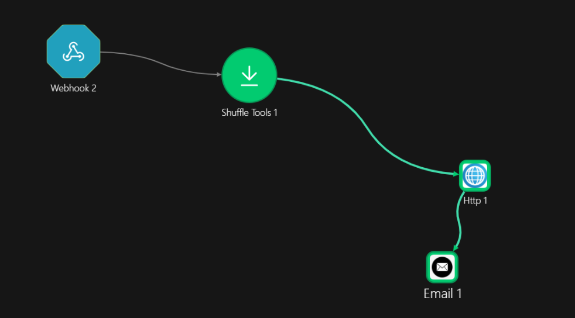

<!-- SCREENSHOT : Email WannaCry enrichi -->
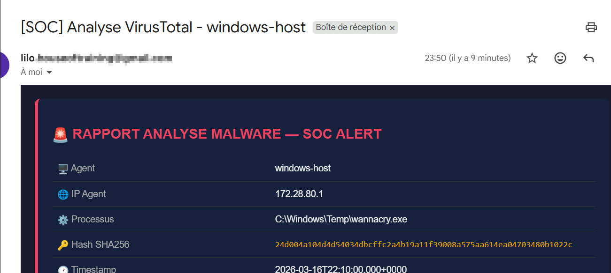

---

## 🐝 TheHive — Gestion d'Incidents

TheHive transforme chaque alerte Wazuh en **ticket d'incident** gérable par l'équipe SOC.

**Intégration via API REST dans Shuffle :**
```json
POST http://localhost:9000/api/alert
Authorization: Bearer {API_KEY}

{
  "title": "$exec.all_fields.rule.description",
  "description": "Agent: $exec.all_fields.agent.name\nIP: $exec.all_fields.agent.ip\nRule: $exec.all_fields.rule.id\nLevel: $exec.all_fields.rule.level",
  "type": "external",
  "source": "Wazuh",
  "sourceRef": "$exec.all_fields.id",
  "severity": 2,
  "tlp": 2,
  "tags": ["wazuh", "soc-lab"]
}
```

**Résultat — 14 tickets créés automatiquement :**

<!-- SCREENSHOT : TheHive avec alertes -->
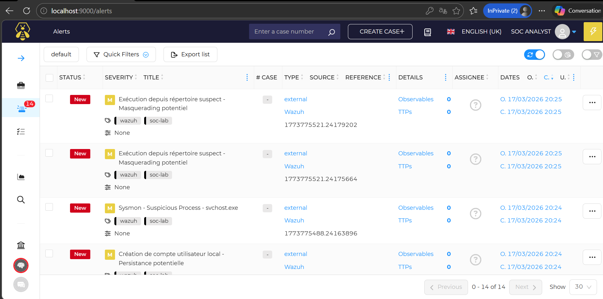

| Champ | Valeur |
|-------|--------|
| Status | New |
| Source | Wazuh |
| Severity | Medium (2) |
| TLP | Amber (2) |
| Tags | wazuh, soc-lab |

---

## 🐛 Problèmes Rencontrés et Solutions

Ce projet m'a confronté à de nombreux problèmes techniques réels. Voici les principaux avec leurs solutions.

---

### Problème 1 — Port 1514 bloqué par tenzir-node

**Symptôme :**
```
Error: Bind for 0.0.0.0:1514 failed: port is already allocated
```

**Cause :** Le conteneur `tenzir-node` (résidu Shuffle) occupait le port UDP 1514 utilisé par Wazuh.

**Solution :**
```bash
docker ps -a | grep 1514
docker stop tenzir-node && docker rm tenzir-node
docker compose up -d
```

---

### Problème 2 — Config ossec.conf corrompue

**Symptôme :**
```
wazuh-analysisd: ERROR: Element 'group' not closed. (line 61)
```

**Cause :** Utilisation répétée de `sed -i` avait créé des structures XML dupliquées avec double `</ossec_config>`.

**Solution :**
```bash
docker cp single-node-wazuh.manager-1:/var/ossec/etc/ossec.conf ~/ossec.conf
grep -n "</ossec_config>" ~/ossec.conf | head -1  # → ligne 298
head -n 298 ~/ossec.conf > ~/ossec_clean.conf
cat >> ~/ossec_clean.conf << 'EOF'
  <integration>...</integration>
</ossec_config>
EOF
docker cp ~/ossec_clean.conf single-node-wazuh.manager-1:/var/ossec/etc/ossec.conf
```

---

### Problème 3 — Variables Shuffle non résolues dans VirusTotal

**Symptôme :**
```
URL: https://www.virustotal.com/api/v3/files/$shuffle_tools_1.group_0
```

**Cause :** L'app VirusTotal v3 native de Shuffle ne résout pas les variables dynamiques dans le champ ID.

**Solution :** Remplacer par un nœud **HTTP** générique qui résout correctement les variables.

---

### Problème 4 — Hash envoyé avec crochets `["hash"]`

**Symptôme :**
```
URL: https://www.virustotal.com/api/v3/files/%5B%2224d004a...%22%5D
```

**Cause :** `group_0` de Shuffle Tools retourne un array JSON `["hash"]`.

**Solution :** Ajouter un second nœud Shuffle Tools :
```
Shuffle Tools 1 (SHA256=...) → Shuffle Tools 2 ([A-Fa-f0-9]{64}) → HTTP VT
```

---

### Problème 5 — Rule 67027 sans hash SHA256

**Symptôme :** Aucun hash dans les alertes Sysmon.

**Cause :** Rule 67027 = Windows Security Event ID 4688, pas de hash. Les vrais events Sysmon avec hash sont en rule 92052.

**Solution :**
```bash
docker exec single-node-wazuh.manager-1 grep -B2 "hashes" /var/ossec/logs/alerts/alerts.log | grep "Rule:"
# → Rule: 92052
sed -i 's/<rule_id>67027/<rule_id>92052/' /var/ossec/etc/ossec.conf
```

---

### Problème 6 — Conflit port 9200 Wazuh/Shuffle

**Solution :**
```bash
sed -i 's/9200:9200/9201:9200/g' ~/Shuffle/docker-compose.yml
```

---

### Problème 7 — RAM insuffisante pour TheHive

**Symptôme :** `java.util.concurrent.TimeoutException` sur TheHive.

**Cause :** WSL2 limité à 8GB par défaut, TheHive nécessite 2GB supplémentaires.

**Solution :** Créer `C:\Users\<user>\.wslconfig` :
```
[wsl2]
memory=12GB
processors=4
swap=4GB
```

---

## ⚔️ Atomic Red Team — Simulation d'Attaques Réelles

[Atomic Red Team](https://github.com/redcanaryco/invoke-atomicredteam) est une bibliothèque de tests développée par Red Canary qui simule des techniques d'attaque MITRE ATT&CK réelles sur la machine Windows — sans danger pour le système.

> **Objectif** : Vérifier que chaque règle Wazuh détecte bien les attaques qu'elle est censée couvrir.

### Installation

```powershell
# Installer le module
IEX (IWR 'https://raw.githubusercontent.com/redcanaryco/invoke-atomicredteam/master/install-atomicredteam.ps1' -UseBasicParsing)
Install-AtomicRedTeam -getAtomics -Force

# Ajouter exclusion Defender pour le dossier de test
Add-MpPreference -ExclusionPath "C:\AtomicRedTeam"

# Désactiver Defender temporairement pour les tests
Set-MpPreference -DisableRealtimeMonitoring $true
```

---

### Tests Effectués

#### 🔴 T1547.001 — Persistance via Registre Run

**Objectif** : Simuler l'ajout d'une clé de persistance dans `HKCU\...\CurrentVersion\Run`

```powershell
Import-Module "C:\AtomicRedTeam\invoke-atomicredteam\Invoke-AtomicRedTeam.psd1"
Invoke-AtomicTest T1547.001 -TestNumbers 1
```

**Résultat Atomic Red Team :**
```
Executing test: T1547.001-1 Reg Key Run
L'opération a réussi.
Exit code: 0
Done executing test: T1547.001-1 Reg Key Run
```

**Détection Wazuh :**
```json
{
  "rule.id": "92302",
  "rule.description": "Registry entry to be executed on next logon was modified",
  "data.win.eventdata.targetObject": "HKU\\...\\CurrentVersion\\Run\\Atomic Red Team",
  "data.win.eventdata.details": "C:\\Path\\AtomicRedTeam.exe",
  "rule.mitre.id": "T1547.001",
  "rule.mitre.tactic": "Persistence, Privilege Escalation"
}
```

✅ **Détecté** — Sysmon Event ID 13 (Registry value set) capturé par Wazuh

<!-- SCREENSHOT : Test Atomic Red Team + résultats -->
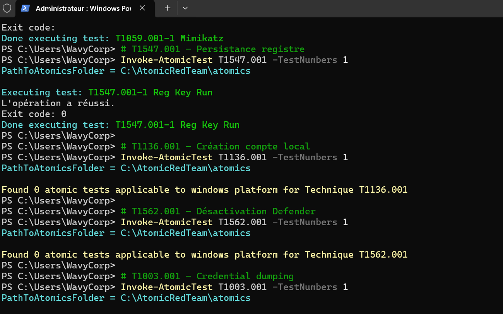

---

#### 🔴 T1059.001 — PowerShell Obfusqué

**Objectif** : Simuler l'exécution de commandes PowerShell suspectes

```powershell
Invoke-AtomicTest T1059.001 -TestNumbers 1
```

**Détection Wazuh :**
```json
{
  "rule.id": "100001",
  "rule.description": "PowerShell suspect - Commande obfusquée ou téléchargement détecté",
  "rule.level": 12,
  "rule.mitre.id": "T1059.001",
  "rule.mitre.tactic": "Execution"
}
```

✅ **Détecté** — Rule custom 100001 déclenchée, level 12

---

### Pipeline de Détection Complet

```
Atomic Red Team (attaque simulée)
         ↓
    Sysmon (télémétrie)
         ↓
  Wazuh Agent (collecte)
         ↓
 Wazuh Manager (analyse + règle MITRE)
         ↓
    Shuffle SOAR
    ↙           ↘
TheHive        Email enrichi
(ticket)       (analyste)
```

<!-- SCREENSHOT : Dashboard Wazuh avec alertes Atomic Red Team -->
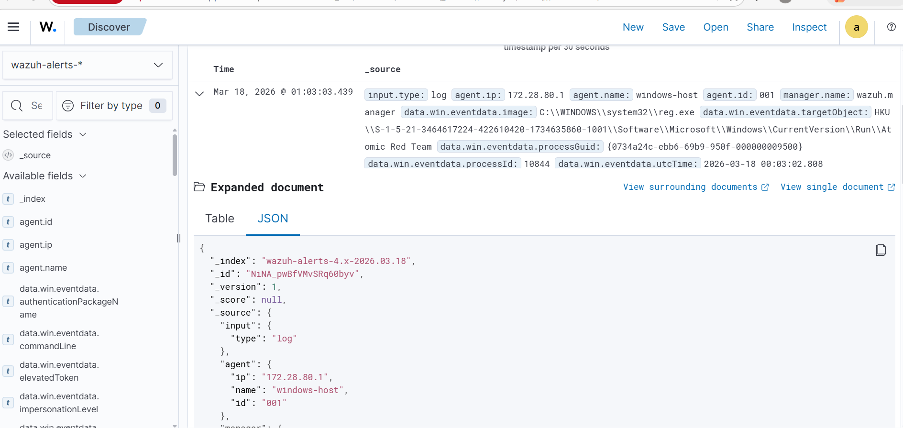

---

### Résultats des Tests

| Technique | Description | Résultat | Rule Wazuh | Level |
|-----------|-------------|----------|------------|-------|
| T1547.001 | Persistance registre Run | ✅ Détecté | 92302 | 6 |
| T1059.001 | PowerShell obfusqué | ✅ Détecté | 100001 | 12 |

---

### Cleanup — Suppression des Traces

```powershell
# Cleanup des tests
Invoke-AtomicTest T1547.001 -TestNumbers 1 -Cleanup
Invoke-AtomicTest T1059.001 -TestNumbers 1 -Cleanup

# Réactiver Windows Defender
Set-MpPreference -DisableRealtimeMonitoring $false

# Supprimer Atomic Red Team
Remove-Item -Path "C:\AtomicRedTeam" -Recurse -Force
Remove-MpPreference -ExclusionPath "C:\AtomicRedTeam"
```

> ⚠️ **Note sécurité** : Toujours réactiver Defender et supprimer les fichiers de test après utilisation en lab.

---

## 📊 Résultats

### Volume d'alertes générées

| Type | Nombre | Pipeline |
|------|--------|----------|
| Alertes email générales | 94+ | Workflow 1 |
| Tickets TheHive créés | 14+ | Workflow 1 |
| Analyses VirusTotal | 10+ | Workflow 2 |
| Détections Sysmon | 30+ | Wazuh Discover |

### Performance

```
Événement Windows → Email + Ticket TheHive : < 30 secondes
Événement Windows → Analyse VirusTotal     : < 45 secondes
```

<!-- SCREENSHOT : All Workflow Runs Shuffle -->
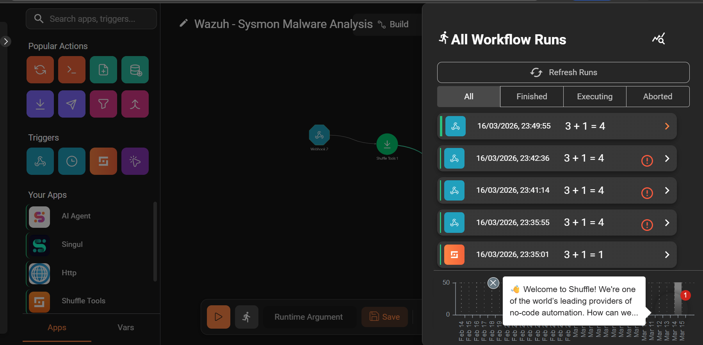

---

## 📁 Structure du Repo

```
soc-automation-lab/
├── README.md
├── deploy.sh                           # 🚀 Déploiement automatique
├── stop.sh                             # 🛑 Arrêt des services
├── .env.example                        # Template des variables d'environnement
├── assets/
│   ├── wazuh.png                       # Logo Wazuh
│   ├── shuffle.jpg                     # Logo Shuffle
│   └── thehive.png                     # Logo TheHive
├── rules/
│   └── custom_local_rules.xml          # 11 règles MITRE ATT&CK
├── config/
│   └── ossec.conf                      # Config Wazuh Manager
├── docker/
│   ├── wazuh-docker-compose.yml        # Stack Wazuh
│   ├── shuffle-docker-compose.yml      # Stack Shuffle
│   └── thehive-docker-compose.yml      # Stack TheHive
├── playbooks/
│   ├── Wazuh-Alert-PowerShell.json     # Workflow Shuffle 1 — Email + TheHive
│   └── Wazuh - Sysmon Malware Analysis.json  # Workflow Shuffle 2 — VirusTotal
└── screenshots/
    ├── wazuh-dashboard.png
    ├── wazuh-agent.png
    ├── sysmon-logs.png
    ├── wazuh-alerts.png
    ├── shuffle-workflow-email.png
    ├── shuffle-workflow-vt.png
    ├── shuffle-runs.png
    ├── email-alerte.png
    ├── email-wannacry-enrichi.png
    ├── thehive-dashboard.png
    ├── thehive-alerts.png
    ├── testatomic.png                  # Tests Atomic Red Team
    └── atomic.png                      # Pipeline détection Atomic
```

---

## 🎓 Ce que j'ai Appris

### Compétences techniques acquises

- **Déploiement Docker** — Stack multi-conteneurs avec dépendances complexes (Wazuh + Shuffle + TheHive)
- **SIEM Wazuh** — Règles XML, intégrations, corrélation d'événements, troubleshooting
- **Sysmon** — Télémétrie Windows avancée, extraction de hashes SHA256
- **SOAR Shuffle** — Workflows automatisés, manipulation de variables JSON, regex
- **TheHive** — Déploiement, API REST, gestion d'incidents
- **VirusTotal API v3** — Interrogation programmatique de threat intelligence
- **MITRE ATT&CK** — Mapping de 11 techniques sur des règles de détection réelles

### Compétences SOC développées

- **Analyse de logs** — Identifier les vrais rule IDs Sysmon vs Windows Security
- **Troubleshooting** — Diagnostiquer des pipelines complexes nœud par nœud
- **Threat Intelligence** — Enrichissement automatique des alertes avec VirusTotal
- **Incident Response** — Pipeline complet détection → analyse → ticket → notification
- **Infrastructure as Code** — Scripts deploy.sh/stop.sh pour reproductibilité

---

## 🔮 Prochaines Étapes

- [x] **Wazuh SIEM** — Déploiement et configuration ✅
- [x] **Agent Windows + Sysmon** — Télémétrie avancée ✅
- [x] **11 règles MITRE ATT&CK** — Détection personnalisée ✅
- [x] **Shuffle SOAR** — Automatisation des réponses ✅
- [x] **VirusTotal** — Enrichissement Threat Intelligence ✅
- [x] **TheHive** — Gestion de tickets d'incidents ✅
- [x] **Atomic Red Team** — Simulation d'attaques MITRE ATT&CK réelles ✅
- [ ] **Blocage IP automatique** — Réponse active via Shuffle
- [ ] **Dashboard MITRE ATT&CK** — Visualisation des techniques détectées
- [ ] **Corrélation multi-alertes** — Détection de chaînes d'attaque complètes

---

## 👤 Auteur

**Lilo Bennardo**
- 🎓 M2 Cybersécurité
- 🎯 Objectif : CDI SOC Analyste N1/N2
- 🔗 [GitHub](https://github.com/LiloBennardo)
- 💼 [LinkedIn](https://linkedin.com/in/lilo-bennardo)

---

## 📄 Licence

MIT License — voir [LICENSE](LICENSE)

---

<div align="center">

**⭐ Si ce projet vous a été utile, n'hésitez pas à laisser une étoile !**

*Construit avec ❤️ pour apprendre la cybersécurité défensive*

</div>
